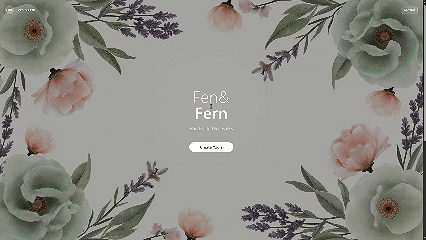

# Ecom-Whatsapp Form



*Building the future of AI-powered web experiences*

<div align="center">

[](https://vitejs.dev/)
[](https://reactjs.org/)
[](https://www.typescriptlang.org/)
[](https://tailwindcss.com/)

</div>

---

## 🚀 Project Overview

**Ecom-Whatsapp Form** is a cutting-edge web application that integrates e-commerce functionality with WhatsApp messaging. Built with modern technologies, it showcases best practices in full-stack development and user experience design.

### ✨ Key Features

- 🎨 **Modern UI/UX** - Clean, intuitive design with glassmorphism elements
- ⚡ **Lightning Fast** - Powered by Vite for instant development experience
- 🔒 **Type Safety** - Full TypeScript implementation for robust code
- 📱 **Responsive** - Perfect on all devices and screen sizes
- 🎭 **Component Library** - Built with shadcn/ui for consistency
- 💬 **WhatsApp Integration** - Seamless messaging capabilities
- 🛒 **E-commerce Ready** - Built for online business needs

---

## 🛠️ Technology Stack

<div align="center">

| Frontend | Styling | Tools | Build |
|----------|---------|-------|--------|
|  |  |  |  |
|  |  |  |  |

</div>

---

## 🚀 Quick Start Guide

### Prerequisites

- **Node.js** (v18+ recommended) - [Install with nvm](https://github.com/nvm-sh/nvm#installing-and-updating)
- **npm** or **yarn** package manager

### Local Development

```sh
# Step 1: Clone the repository
git clone <YOUR_GIT_URL>

# Step 2: Navigate to the project directory
cd <YOUR_PROJECT_NAME>

# Step 3: Install dependencies
npm i

# Step 4: Start development server
npm run dev
